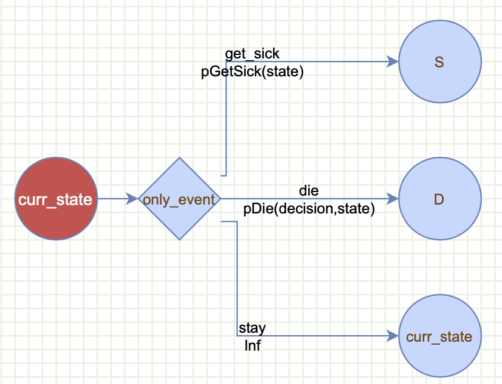

```{r, include = FALSE}
knitr::opts_chunk$set(
  collapse = TRUE,
  comment = "#>"
)
```

{width="1000"}

The purpose of this vignette is to demonstrate how gmod can be used to build common features of a Markov model. For decision modeling, please check the getting started with decision modeling vignette.

For a graphical interface to build the gmod syntax, please check <https://www.dashlab.ca/projects/decision_twig>.

This vignette only explains the features one at a time to emphasize each individual feature. For examples on how to build a complete Markov model or a decision model, please refer to the detailed introductory and advanced Markov tutorial vignettes for Markov models, and the Herpes Simplex Virus (HSV) and the Doubilet vignettes for decision tree examples.

# Overview of gmod:

gmod is built on the grammar of modeling principle which aims to describe a model in terms of its main components. The idea is to reduce the complexity of a decision/Markov model to it's principal components (Twigs). gmod is inspired by the grammer of graphics (ggplot) and the grammar of data wranggling (dplyr) package for data wrangling. Similar to ggplot which builds a graph by combining layers, gmod then *writes* the model code for you!

## gmod functions:

gmod has two main external functions. The first function is `gmod()` which instantiates the basic gmod object that can be supplemented with one or more twigs containing the components of the Markov model.

a gmod syntax for a Markov model currently consist of the following twigs:

-   `decisions`: a single twig that lists the decisions or strategies that we want to compare
-   `states`: a single twig that describes the Markov states, their initial probabitlities and the number of tunnel cycles (defaults to 1).
-   `event`: one or more twig describing, how events control transition among states. These transitions can be conditional on the decisions, Markov states, previous events, number of cycles, and number of cycles in a state (i.e., tunnels).
-   `payoffs`: a single payoff twig, such as costs, effectiveness, utility, ... etc. Similar to the events, these can also depend on the decisions, Markov states, events, number of cycles, and number of cycles in a state (i.e., tunnels).

The second function is `gmod_gen_model_function()` which returns mainly creates a new function named `my_markov_model` that represents the model code in standard R that can be run independently of gmod. This function also returns other useful information, such as the model structure and the equations involved in the transition probabilities and payoffs ...etc.

The `my_markov_model()` represents the entire model structure, and can be called directly. This function takes in a parameter list `param` which include the model parameter values, and returns the Markov results, such as the discounted lifetime costs and quality adjusted life-years (QALYs). It is important to pass the number of cycles `n_cycles` as a parameter as we discussed below. As described below, in addition to the main payoffs, this function can also return other intermediate outputs, such as the transitional probability matrices, the cohort's Markov trace over time, and others.

We will start with building a minimal Markov model to illustrate the basic principles of `gmod`. Then, we will introduce how to add other functionality, such as cycle dependency, tunnels...etc. For each feature, we will only show how to add that feature to reduce complexity. For full models that contain many of these features in the same model, please refer to the introductory and advanced Markov tutorials vignettes.

# A minimal example

We will adapt the sick-sicker model (ref) that we often use in our DARTH materials and teachings.

First, install gmod using devtools. Also, make sure to enable use_vignettes so that vignettes render correctly.

```{r}
#library(devtools)
#install_github("hjalal/gmod", use_vignettes = TRUE, force = TRUE)
```

Then, load the `gmod` library and the `magrittr` library needed for the pipe `%>%` operator.

```{r setup}
rm(list = ls())
library(gmod)
library(magrittr)
```

## defining a basic Markov model using gmod() and Decision Twigs

We will start with a basic `gmod()` syntax looks like this:

```{r}
mygmod <- gmod() + 
  decisions("StandardOfCare", "StrategyA") + 
  states(names = c("H", "S", "D"), init_probs = c(1,0,0)) + 
  event(name = "only_event",  
        scenarios = c("get_sick", "die", "stay"), 
        probs = c(pGetSick(state), pDie(decision, state), Inf), 
        outcomes = c("S", "D", "curr_state")) +  
  payoffs(cost = compute_cost(decision, state))
```

To have a graphical representation, we can copy this code into Decision Twigs to generate the twigs:

Here are the explanation of what each twig does:

-   `decisions("StandardOfCare", "StrategyA")`: define the first twig which is a decision with two strategies involved: StandardOfCare and StrategyA
-   `states(...)`: defines the Markov twig. There must be only one of these per model. The states funciton takes in 3 arguments:
    -   names: H for healthy, S for sick and D for dead.
    -   init_probs for initial probabilities, and
    -   optional max_cycle_in_states which defines the maximum number of tunnel states per state. This option is omitted here, so the function uses the default of 1.
-   `event(...)`: is the most powerful feature in gmod and it governs how the states are linked through events. In the Grammar of Modeling we distinguish between a *state* and an *event*. We use a noun for a `state` to indicate where the cohort stays a full cycle (e.g., one year), and use a verb to refer to an `event`, which in a Markov world is instantaneous and doesn't take any time at all (e.g., `get_sick` for getting sick). There has to be at least one `event` twig, but there can be more events that can be chained together as we explain below. The event mapping takes in four arguments: name, scenarios, outcomes, and probs. We will explain each of these separately:
    -   `event = "only_event"`: defines the event name. Each event must have a unique name that can be referenced by other events's probability statements or payoff equations as described below.
    -   `scenarios = c("get_sick", "die", "stay")`: defines the event scenarios: here the event can only be one of these: getting sick, dying or staying in the current state.
    -   `probs = c(pGetSick(state), pDie(decision, state), Inf))`: these are the probabilities of the correspondign scenarios occuring. A powerful feature of gmod is that it allows these probabilities to be conditional on other model components. Here we define the probability of only_event==get_sick by calling pGetSick(state) which is dependent on the state. Similarly, the probability of only_event==die is defined by calling `pDie(decision, state)` which we tell gmod that is dependent on the state and the decision. `pGetSick` and `pDie` are user-defined functions that we describe below. The `Inf` is used to tell gmod to compute the complementary probability for the probability of staying in the same state: (i.e., 1-pGetSick(state)-pDie(state)) to reduce the amount of typing needed.
    -   `outcomes = c("S", "D", "curr_state")`: defines the outcomes of each one of the event values. getting sick ends up in the S state, dying ends up in the D state, and staying will return to whichever state the cohort was in using the special keyword `"curr_state"`.
-   `payoffs(cost = cost(decision, state))`: defines a single payoff hers. Here we only have a cost payoff that is dependent on the state and decision. More than one payoff can be described here, but only a single payoff twig is allowed. And, similar to the probs argument these can be a function of other model components, such as decision, state, cycles, events, tunnels, ...etc

## User-defined functions for probabilities and payoffs

In this section, we define the three functions: `pGetSick`, `pDie` and `cost` that we use above in our `event_mapping` and the `payoffs()` layers above:

```{r}
pGetSick <- function(state){
  if(state=="H") 0.1 else 0
}

pDie <- function(decision, state){
  switch(state, "H"=0.01, 
         "S"= if (decision=="StrategyA") 0.02 else 0.05, 
         "D"=0)
}

compute_cost <- function(decision, state){
  cost_state <- switch(state, "H"=1000, "S"=5000, "D"=0)
  cost_decision <- if(decision=="StrategyA" & state=="S") 2000 else 0
  cost_state+cost_decision
}
```

pGetSick is a simple function with a single if else statement. Probability of getting sick is 0.1 if one is Healthy, otherwise is 0.

pDie is a function of bothe the decision and state. Probability of death is 0.01 if Healthy, 0.02 if sick (+TreatmentA), 0.05 if Sick+StandardOfCare, and 0 if already dead.

compute_cost calculates the cost of the disease by combining the cost of the state \$1000 if Healthy, \$5000 if sick and \$0 if Dead. In addition, it computes the cost of the decision as an additional \$2000 if one receives TreatmentA compared to the standard of care.

As your functions get more complex, we recommended that you test them to make sure they return outcomes for all possible combinations of states and decisions and other input arguments. For example, the simple code below tests the functions for all possible combinations of decisions and states.

Evaluate the functions 
```{r}
gmod_expand_functions(mygmod)
head(df_pDie)
```


```{r}
for (decision in c("StandardOfCare", "StrategyA")){
  for (state in c("H", "S", "D")){
    cat("decision:", decision, " state:", state, " pGetSick:", pGetSick(state), 
        " pDie:", pDie(decision, state), " cost:", compute_cost(decision, state), "\n")
  }
}

```

The functions seem to be outputting the correct numbers. switch is similar to if else, but can be more compact than multiple if else statements.

## Running the model

Now we have all the ingredients to run the model.

First, we need to generate the model function code

```{r}
model_struc <- gmod_gen_model_function(mygmod)
```

This will create the `model_struc` which contains the model equations and formulae and can be examined, and as stated in the generated note, this function also produces a function representation of the Markov model. The default name of this function is `my_markov_model.`

Let's examine the content of these two object. First, let's check the model structure

```{r}
model_struc # returns the model structure including the formulae before evaluation
```

examining the content of this structure can be helpful to debug a model by examining the individual layers and formulae. For example \$model_equations returns the probability and cost formulae as plain text. These can be evaluated by calling them directly if needed. For example, if we want to know what is the probability of staying at the Healthy state we can just copy the content of the probs column corresponding to curr_state and evaluate it with the corresponding parameters:

```{r}
(1-(pGetSick(state="H")+pDie(decision="StandardOfCare",state="H"))) 
```

Next, we can also examine the contents of the my_markov_model function which generates the text.

```{r}
my_markov_model #without parenthesis returns the function text
```

The generated code is build on our introductory and advanced Markov tutorials in *Medical Decision Making*. For further information, please refer to these tutorials.

Now, let's run the model function and generate our summary results of running the model for 5 cycles and computing the cumulative cost for our cohort.

```{r}
n_cycles <- 10
my_markov_model(model_struc)
```

You can also retrieve the other components of the Markov model run, such as the Markov trace which shows the proportion of the cohort in each of the states for each of the 5 cycles.

```{r}
model_results <- my_markov_model(model_struc, return_trace = T)
model_results$Trace
```

# changing basic features of our Markov model:

We start by modifying some of the basic features of our markov model. We will explore how to change the number of Markov cycles, the initial probabilities, and the discount rates.

## changing the number of cycles:

Changing the number of Markov cycles is straightforward by changing the `n_cycles` parameter in the `gmod` function. For example, below we change the number of cycles from 5 to 2:

```{r}
mygmod <- gmod()
```

## changing initial probabilities:

We can set the initial probabilities in various ways. Most of the time we start the cohort in the same health state. Above we showed how to set it up when everyone starts at the Healthy state.

```{r}
states(names = c("H","S","D"), init_probs = c(1,0,0))
```

However, we can do any distribution we want. For example, we can define the starting probabilities for all the states.

```{r}
states(names = c("H","S","D"), init_probs = c(0.7,0.2,0.1))
```

Or, we can even use a combination of variables and Inf as a placeholder for the complementary probabilities.

```{r}
pH0 <- 0.7
pS0 <- 0.2
states(names = c("H","S","D"), init_probs = c(pH0, pS0, Inf))
```

To run the model with this updated probabilities, we need to add it as a new `init_prob` layer to the `gmod` code.

```{r}
mygmod <- gmod() + 
  decisions("StandardOfCare", "StrategyA") + 
  states(names = c("H","S","D"), init_probs = c(pH0, pS0, Inf)) + 
  event(name = "only_event",  
              scenarios = c("get_sick", "die", "stay"), 
              probs = c(pGetSick(state), pDie(decision, state), Inf), 
              outcomes = c("S", "D", "curr_state")) +  
  payoffs(cost = compute_cost(decision, state))
  
# creating the updated function and evaluating it
model_struc <- gmod_gen_model_function(mygmod)
model_results <- my_markov_model(model_struc, return_trace = T)
model_results$Trace

```

We can see from the first line of the Trace that H=0.7, S=0.2 and D=0.1.

gmod tries to check the composition of the probability vector and returns an error if there are any inconsistencies.

## changing the discount rates

Changing the discount rate is similar to setting the initial probabilities. These can be set for all the payoffs. To illustrate, we will add an additional payoff (effectiveness), and use a discount rate of 3% per cycle for both costs and utilities.

```{r}
mygmod <- gmod() + 
  decisions("StandardOfCare", "StrategyA") + 
  states(names = c("H", "S", "D"), init_probs = c(1,0,0)) +
  event(name = "only_event",  
        scenarios = c("get_sick", "die", "stay"), 
        probs = c(pGetSick(state), pDie(decision, state), Inf), 
        outcomes = c("S", "D", "curr_state")) +  
  payoffs(cost = compute_cost(decision, state), 
          effectiveness = compute_effectiveness(state), 
          discount_rates = c(0.03, 0.03))

# define the effectiveness function, the rest of the function will be just like before
compute_effectiveness <- function(state){
  switch(state, "H"=1, "S"=0.7, "D"=0)
}

# creating the updated function and evaluating it
model_struc <- gmod_gen_model_function(mygmod)
# we look at the cycle payoffs which apply the discounts to the cycle payoffs.
my_markov_model(model_struc, return_cycle_payoffs=TRUE)
```

# Transition probability and payoffs conditional on Markov cycle:

Sometimes we want a probability of transition from one state to another, or a payoff's value to depend on the cohort's age. We can achieve this by using the special variable cycle for both transition probabilities and payoffs.

The code below shows the previous code in a single block where we modify the probability of death and cost payoff to depend on cycle. See if you can spot the difference:

```{r}
mygmod <- gmod() + 
  decisions("StandardOfCare", "StrategyA") + 
  states(names = c("H", "S", "D"), init_probs = c(1,0,0)) +
  event(name = "only_event",  
              scenarios = c("get_sick", "die", "stay"), 
              probs = c(pGetSick(state), pDie(decision, state, cycle), Inf), 
              outcomes = c("S", "D", "curr_state")) +  
  payoffs(cost = compute_cost(decision, state, cycle))

pGetSick <- function(state){
  if(state=="H") 0.1 else 0
}

pDie <- function(decision, state, cycle){
  switch(state, "H"=0.01, 
       "S"= if (decision=="StrategyA") 0.02 else 0.05, 
       "D"=0) * cycle
}

compute_cost <- function(decision, state, cycle){
  cost_state <- switch(state, "H"=1000, "S"=5000, "D"=0) * cycle
  cost_decision <- if(decision=="StrategyA" & state=="S") 2000 else 0
  cost_state+cost_decision
}

model_struc <- gmod_gen_model_function(mygmod)
```

Of course, we only need to add the variable cycle to the function definitions `pDie` and `compute_cost` and also remember to add them to the function calls in the `gmod` function. For illustration we assume that `pDie` and the `cost` of the states both increased as a linear function of the Markov cycles, 1X, 2X, ..., 5X for cycles 1 through 5, respectively. Let's check first to see that our functions are correct, and then we will run the model and inspect the outputs.

```{r}
for (decision in c("StandardOfCare", "StrategyA")){
  for (state in c("H", "S", "D")){
    for (cycle in 1:2){ # just print the first two cycles
          cat("decision:", decision, " state:", state, " cycle:", cycle, " pGetSick:", pGetSick(state), 
        " pDie:", pDie(decision, state, cycle), " cost:", compute_cost(decision, state, cycle), "\n")
    }
  }
}

```

Now we can examine the impact of this on the model results

```{r}
model_struc <- gmod_gen_model_function(mygmod)
my_markov_model(model_struc)
```

## Transition probabilty and payoff dependency on the number of cycles in a state (tunnel states or state residency):

Sometimes we have a different situation where we want to keep track of how long the cohort has been in a particular state to model *history* of a disease. We usually do this by creating what is called tunnel states and expanding the number of states for example S1, S2, ..., etc. where a transition to S2 is only possible from S1 and to S3 from S2, ... etc.

Here we show how to do this again for pDie and compute_cost. We are only interested of a history of 3 years. Again - can you spot the difference compared to the minimal model?

```{r}
mygmod <- gmod() + 
  decisions("StandardOfCare", "StrategyA") +
  states(names = c("H", "S", "D"), init_probs = c(1,0,0), max_cycle_in_states = c(1,3,1)) +  #
  event(name = "only_event",  
              scenarios = c("get_sick", "die", "stay"), 
              probs = c(pGetSick(state), pDie(decision, state, cycle_in_state), Inf), 
              outcomes = c("S", "D", "curr_state")) + #
  payoffs(cost = compute_cost(decision, state, cycle_in_state)) #

pGetSick <- function(state){
  if(state=="H") 0.1 else 0
}

pDie <- function(decision, state, cycle_in_state){ #
  switch(state, "H"=0.01, 
       "S"= cycle_in_state * if (decision=="StrategyA") 0.02 else 0.05, 
       "D"=0) 
}

compute_cost <- function(decision, state, cycle_in_state){ #
  cost_state <- switch(state, "H"=1000, "S"=5000 * cycle_in_state, "D"=0)  #
  cost_decision <- if(decision=="StrategyA" & state=="S") 2000 else 0
  cost_state+cost_decision
}

model_struc <- gmod_gen_model_function(mygmod)
```

It is quite simple to add tunnel dependency by adding the `cycle_in_state` variable.

IMPORTANT: when a model has at least on state that has time dependency, the `cycle_in_state` variable becomes avaialble for all the states. States that are not defined in the `tunnels()` layer will always return `cycle_in_state=1`

Similar to above, we assume that the probability of death is a linear function of the number of cycles in S. For the cost, we also assume that the longer you stay in S the higher the cost will be - also linearly related.

The other important change is that we have to add a tunnels() layer specifying the states that have residency time history dependency. Here we assume only S has time dependency for 3 cycles only. This can be expanded to multiple states with various tunnel lengths.

Let's check first to see that our functions are correct, and then we will run the model and inspect the outputs.

```{r}
for (decision in c("StandardOfCare", "StrategyA")){
  for (state in c("H", "S", "D")){
    for (cycle_in_state in 1:2){ # just print the first two cycles
          cat("decision:", decision, " state:", state, " cycle_in_state:", cycle_in_state, " pGetSick:", pGetSick(state), 
        " pDie:", pDie(decision, state, cycle_in_state), " cost:", compute_cost(decision, state, cycle_in_state), "\n")
    }
  }
}
```

Now we can examine the impact of this on the model results

```{r}
model_struc <- gmod_gen_model_function(mygmod)
model_results <- my_markov_model(model_struc, return_transition_prob = T, return_state_payoffs = T)
```

Let's examine the transition probability matrix structure with the tunnel state

```{r}
model_results$P # shows transition probabilities to Death
```

This returns a list of two 5x5 matrices for the transition probabilities of the two strategies. These matrices describe the probability of transition from an origin state (row) to a destination state (column). Now notice that S is being replaced by S_tnl1, S_tnl2 and S_tnl3 indicating the three cycles in S as separate states. Also notice the special way transitions occur among these states. i.e., each tunnel state goes to the next one, but never back or stay in the same state except for the last state in the tunnel, here S_tnl3. Since we made the probability of death a function of the tunnel state, we can see that the probabiltiy of death for StandardOfCare (last column) for S_tnl1 = 0.05, S_tnl2=0.10 and S_tnl3=0.15 as we specified in our function. Similarly, the probability of death under StrategyA also incrases linearly from 0.02 for S_tnl1, to 0.04 for S_tnl2 and 0.06 for S_tnl3.

And, let's examine the cycle payoffs.

```{r}
model_results$state_payoffs # shows cycle payoffs of the Sick state
```

Here you can see that for each year in S, the cost increases by \$5000.

# Multiple Events.

It is relatively easy to add additional events to a Markov model. Please keep in mind that Events are quite flexible and are central to the Grammar of Modeling framework. While users are free to make branching events, we recommend to use a single linear sequence of events, and call previous event values to make the same sequence apply to all decisions and states. For example, if an event doesn't happen for a particular decision (e.g., getting a side effect), then one can make the get_side_effect event a function of the decision, and only have a non-zero probability for that particular treatment. The Grammer of Modeling is designed aroudn the concept of a single sequence of events as it makes the code more concise and easier to manage.

Below we slightly modify the minimal example by converting the Sick state to an event. Assume that Sick is an acute disease that only takes a few days rather than a full cycle. We will have a sequence of events `get_sick` followed by `die`. Because Sick is no longer a state, we will use these two health states Alive and Dead and show how the probability of death can be a function of the event get_sick occuring before the event die. In addition, we will show how the cost can also be a function of the value of the sick_event. We will also look at one strategy "StandardOfCare to simplify the illustration.

```{r}
mygmod <- gmod() + 
  decisions("StandardOfCare") + 
  states(names = c("Alive", "Dead"), init_probs = c(1,0)) + 
  event(name = "get_sick",  
              scenarios = c(TRUE, FALSE), 
              probs = c(0.05, Inf), 
              outcomes = c("die", "die")) +  
  event(name = "die",  
              scenarios = c(TRUE, FALSE), 
              probs = c(pDie(state), Inf), 
              outcomes = c("Dead", "curr_state")) +  
  payoffs(cost = compute_cost(state))

pDie <- function(state){
  # if the cohort gets sick, the probability of death = 0.01 otherwise it is 0.1
  switch(state, "Alive"=0.01,  
                "Dead"=0)
}

compute_cost <- function(state){
  cost_state <- switch(state, "Alive"=1000, "Dead"=0)
  # add 2000 if someone in the Alive state gets sick
  cost_state
}

model_struc <- gmod_gen_model_function(mygmod)
my_markov_model(model_struc,return_transition_prob=TRUE,return_state_payoffs=TRUE,return_trace=TRUE,return_cycle_payoffs=TRUE,return_payoff_summary=TRUE)

```

Notice that now we have two sequential events. The first event is get_sick, the second one is die. Here get_sick doesn't do much because if the cohort gets sick or not, they face the next event die. Next, we will show how to make the probabilit of death a function of the event get_sick and also make the cost also a function of this event.

# Transition and Payoff dependent on prior events

In the previous section, we illustrated how to add multiple sequential events. gmod can also use these prior events to influence the transition probabilities downstream and the payoffs. This can be particularly important to put all the events on a single sequence across decisions and states. Traditional models often duplicate (copy or clone) these events which creates a nested branching problem that can be difficult to manage and troubleshoot.

The other advantage of being able to refer to any event value is the ability to associate payoffs to events. This is often referred to as transitional rewards or payoffs because these payoffs occur when an event occurs. These payoffs are quite different from state payoffs as state payoffs are associated with spending time in states compared to event (transitional) payoffs which are associated with the events that are considered instantaneous and only happens for a portion of the cohort residing in a state.

Below we modify the previous example by making the probability of death a function of the event get_sick occurring upstream. In addition, we will show how the cost can also be a function of the value of the sick_event. We will also look at one strategy "StandardOfCare to simplify the illustration.

```{r}
mygmod <- gmod() + 
  decisions("StandardOfCare") + 
  states(names = c("Alive", "Dead"), init_probs = c(1,0)) + 
  event(name = "get_sick",  
              scenarios = c(TRUE, FALSE), 
              probs = c(0.05, Inf), 
              outcomes = c("die", "die")) +  
    event(name = "die",  
              scenarios = c(TRUE, FALSE), 
              probs = c(pDie(state, get_sick), Inf), 
              outcomes = c("Dead", "curr_state")) +  
  payoffs(cost = compute_cost(state, get_sick))

pDie <- function(state, get_sick){
  # if the cohort gets sick, the probability of death = 0.01 otherwise it is 0.1
  switch(state, "Alive"= if(get_sick==TRUE) 0.1 else 0.01,  
                "Dead"=0)
}

compute_cost <- function(state, get_sick){
  cost_state <- switch(state, "Alive"=1000, "Dead"=0)
  # add 2000 if someone in the Alive state gets sick
  cost_get_sick <- if(get_sick==TRUE & state=="Alive") 2000 else 0
  cost_state+cost_get_sick
}

```

Notice that now we have two sequential events. The first event is die, the second one is get_sick. Now, if die=TRUE, then the cohort moves to the state D, but if D=FALSE, then the cohort moves to the next event get_sick. Then, if get_sick=TRUE, then the cohort moves to the state S, but if not, they will stay in their current state.

The rest of the user-functions can stay the same. Below we show how to use prior events to influence the probability of transition and the payoffs.

```{r}
 for (state in c("Alive", "Dead")){
   for (get_sick in c(TRUE, FALSE)){ # just print the first two cycles
         cat(" state:", state, " get_sick:", get_sick, #
       " pDie:", pDie(state, get_sick), " cost:", compute_cost(state, get_sick), "\n")
   }
 }

```

Now we can examine the impact of this on the model results

```{r}
model_struc <- gmod_gen_model_function(mygmod)
my_markov_model(model_struc,return_transition_prob=TRUE,return_state_payoffs=TRUE,return_trace=TRUE,return_cycle_payoffs=TRUE,return_payoff_summary=TRUE)

```

# Running our model with other parameter values

gmod allows using variables inside the custom functions. These values must be defined in the global environment so that they are accessible within all the functions. To illustrate the use of parameters, we can begin by creating a new list (params) that contains 4 parameters as shown below. In the functions below we replace the values with the variable names we use in the params list. For example, we will use pDieSick in the params = 0.1, and replace the 0.1 we used in the pDie function with the variable name pDieSick. We do the same for the other variables.

```{r}
params <- list(pDieSick = 0.1,
               pDieNotSick = 0.01,
               costAlive = 1000,
               costGetSick = 2000)

mygmod <- gmod() + 
  decisions("StandardOfCare") + 
  states(names = c("Alive", "Dead"), init_probs = c(1,0)) + 
  event(name = "get_sick",  
              scenarios = c(TRUE, FALSE), 
              probs = c(0.05, Inf), 
              outcomes = c("die", "die")) +  
    event(name = "die",  
              scenarios = c(TRUE, FALSE), 
              probs = c(pDie(state, get_sick), Inf), 
              outcomes = c("Dead", "curr_state")) +  
  payoffs(cost = compute_cost(state, get_sick))

pDie <- function(state, get_sick){
  # if the cohort gets sick, the probability of death = 0.01 otherwise it is 0.1
  switch(state, "Alive"= if(get_sick==TRUE) pDieSick else pDieNotSick,  
                "Dead"=0)
}

compute_cost <- function(state, get_sick){
  cost_state <- switch(state, "Alive"=costAlive, "Dead"=0)
  # add 2000 if someone in the Alive state gets sick
  cost_get_sick <- if(get_sick==TRUE & state=="Alive") costGetSick else 0
  cost_state+cost_get_sick
}

model_struc <- gmod_gen_model_function(mygmod)
my_markov_model(model_struc,params=params)

```

gmod allows passing parameter values as a list. The values passed in the list replace the parameter values in the global environment.

## Rerunnign the model with a different set of parameter values

Now, we can simply change the values of the parameter list and rerun the model by simply calling it with a different parameter values. For example, we change the value of pDieSick to 0.3 from 0.1, and change the costGetSick to 10000 from 2000.

```{r}
params <- list(pDieSick = 0.3, # was 0.1
               pDieNotSick = 0.01,
               costAlive = 1000, 
               costGetSick = 10000) # was 2000
my_markov_model(model_struc,params=params)
```

Being able to pass parameters as a list can be helpful when we conduct analyses using the gmod structure. For example, if we want to run a probabilistic sensitivity analysis, deterministic analyses, do value of information, or calibrate our model.

# Summary:

In this Vignette we went over the basic features of the gmod library for building and running Markov models. We illustrated these features one at a time, and show how to define decisions, states, events, payoffs. In addition, we show how to change the number of cycles, the discounting rates. Furthermore, we show how to make transition probabilities and payoffs a function of decisions, states cycles, number of cycles in a state (tunnel) and previous events.

For further details on gmod, please refer to the other vignettes, mainly the introductory and advanced Markov model tutorial vignettes that replicate our anlayses published in *Medical Decision Making*.
