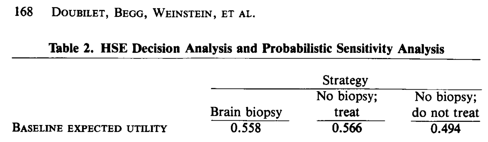
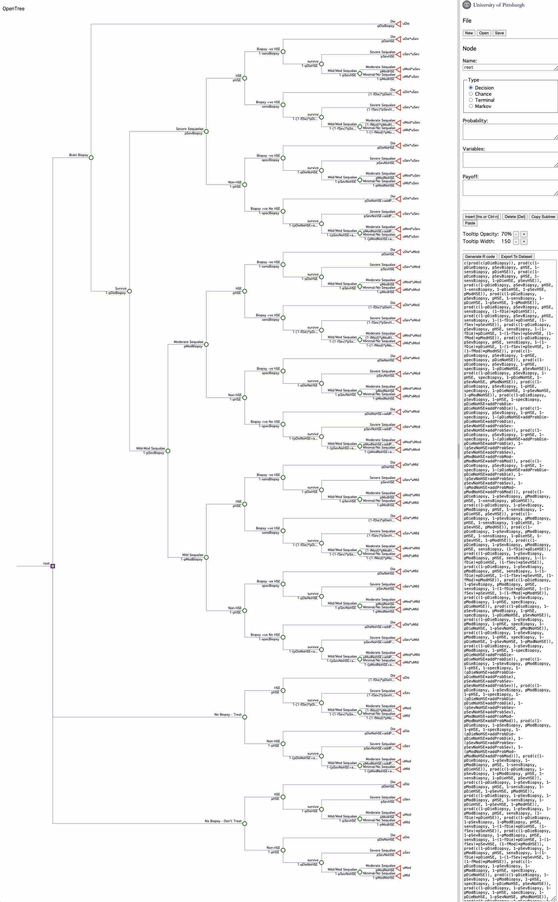

```{r, include = FALSE}
knitr::opts_chunk$set(
  collapse = TRUE,
  comment = "#>"
)
```

This is a relatively complex decision example involves treating herpes simplex encephalopathy and is published in Doubilet.  The full model is described here:

Doubilet, P., Begg, C. B., Weinstein, M. C., Braun, P., & McNeil, B. J. (1985). Probabilistic sensitivity analysis using Monte Carlo simulation: a practical approach. Medical decision making, 5(2), 157-177.


It has the following features:

* How to control asymetrical decision branches - where the events are dependent on the decision
* How to make the probability of an event final_outcome based on the value of a prior (upstream) event
* How to make utility a function of a prior (upstream) event

```{r setup}
rm(list = ls())
library(gmod)
```

Setup model parameters as described in the paper
```{r}
params <- list(
pDieBiopsy = 0.004,
pSevBiopsy = 0.01,
pModBiopsy = 0.03,
sensBiopsy = 0.95,
specBiopsy = 0.99,
pHSE = 0.4, #overall

pDieHSE = .7,
pSevHSE = .333,
pModHSE = .5,

fDie = .37,
fSev = .2,
fMod = .2,

pDieNoHSE = .18,
pSevNoHSE = .122,
pModNoHSE = .139,

addProbDie = .004,
addProbSev = .01,
addProbMod = .02,

uDie = 0,
uSev = 0.02,
uMod = .8,
uMld = 1
)
```

This structure is meant to reproduce the tree structure as presented in Doubilet et al.  However, their tree uses a binary biforcation, where each event can either be TRUE or FASLE.  Below we simplify this tree structure by adding more final_outcomes to each decision branch.  The outcomes are identical. 

## Binary event final_outcomes similar to Doubilet 1985
```{r}
mygmod <- gmod() + 
  decisions("BrainBiopsy", "NoBiopsy_Treat", "NoBiopsy_NoTreat") + 
  #final_outcomes("DEAD","SEVSEQHSE","MODSEQHSE","MLDSEQHSE") + 
  event(name = "Biopsy",  
                scenarios = c(TRUE, FALSE), 
                probs = c(pBiopsy(decision), Inf), 
                outcomes = c("dieBiop", "HSE"))  + 
  event(name = "dieBiop",  
                scenarios = c(TRUE, FALSE), 
                probs = c(pDieBiopsy, Inf), 
                outcomes = c("DEAD", "sevBiopSeq"))  + 
  event(name = "sevBiopSeq",  
                scenarios = c(TRUE, FALSE), 
                probs = c(pSevBiopsy, Inf), 
                outcomes = c("HSE", "modBiopSeq"))  + 
  event(name = "modBiopSeq",  
                scenarios = c(TRUE, FALSE), 
                probs = c(pModBiopsy, Inf), 
                outcomes = c("HSE", "HSE"))  + 
  event(name = "HSE",  
                scenarios = c(TRUE, FALSE), 
                probs = c(pHSE, Inf), 
                outcomes = c("BiopAvail", "BiopAvail"))  +
  event(name = "BiopAvail",  
                scenarios = c(TRUE, FALSE), 
                probs = c(pBiopsy(decision), Inf), 
                outcomes = c("BiopRes", "die"))  + 
  event(name = "BiopRes",  
                #scenarios = c("Positive", "Negative"), 
                scenarios = c(TRUE, FALSE), 
                probs = c(pBiopRes(HSE), Inf), 
                outcomes = c("die", "die"))  + 
  event(name = "die",  
                scenarios = c(T, F), 
                probs = c(pEvent(HSE, decision, BiopRes, pDieHSE, pDieNoHSE, fDie, addProbDie), Inf), 
                outcomes = c("DEAD", "sevSeqHSE")) +
  event(name = "sevSeqHSE",  
                scenarios = c(T, F), 
                probs = c(pEvent(HSE, decision, BiopRes, pSevHSE, pSevNoHSE, fSev, addProbSev), Inf), 
                outcomes = c("SEVSEQHSE", "modSeqHSE")) +
  event(name = "modSeqHSE",  
                scenarios = c(T, F), 
                probs = c(pEvent(HSE, decision, BiopRes, pModHSE, pModNoHSE, fMod, addProbMod), Inf), 
                outcomes = c("MODSEQHSE", "MLDSEQHSE")) + 
  #payoffs(util = util(decision, final_outcome, sevBiopSeq, modBiopSeq))
  payoffs(util = util1(final_outcome)*util2(decision, sevBiopSeq, modBiopSeq))

```


```{r}
pEvent <- function(HSE, decision, BiopRes, pEventHSE, pEventNoHSE, fEvent, addProbEvent){
  # pEventRx <- if (HSE){
  #             (1-fEvent)*pEventHSE
  #             } else {
  #               pEventNoHSE+addProbEvent-pEventNoHSE*addProbEvent
  #             }
  # pEventNoRx <- if (HSE) pEventHSE else pEventNoHSE
  # 
  # if (decision=="NoBiopsy_NoTreat") pEventNoRx else
  #   if (decision=="NoBiopsy_Treat") pEventRx else
  #     if (decision=="BrainBiopsy")
  #       if (BiopRes) pEventRx else pEventNoRx

  # (1-fEvent)*pEventHSE * (HSE & (decision=="NoBiopsy_Treat" | (decision=="BrainBiopsy" & BiopRes))) +
  # (pEventNoHSE+addProbEvent-pEventNoHSE*addProbEvent) * ((!HSE) & (decision=="NoBiopsy_Treat" | (decision=="BrainBiopsy" & BiopRes))) +
  # pEventHSE * (HSE & (decision=="NoBiopsy_NoTreat" | (decision=="BrainBiopsy" & !BiopRes))) +
  # pEventNoHSE * ((!HSE) & (decision=="NoBiopsy_NoTreat" | (decision=="BrainBiopsy" & !BiopRes)))

  # 
# (decision=="NoBiopsy_Treat" | (decision=="BrainBiopsy" & BiopRes)) * (
#   (HSE) * (1-fEvent) + 
#   (!HSE) * (pEventNoHSE+addProbEvent-pEventNoHSE*addProbEvent)
# )
#   
  
  # if they have HSE and receive treatment
pEventHSE * (HSE) * 
  (1-fEvent)^(decision=="NoBiopsy_Treat" | (decision=="BrainBiopsy" & BiopRes)) + 
  # if they don't have HSE and receive treatment
  pEventNoHSE * (!HSE) * 
    (1+addProbEvent*(1/pEventNoHSE-1))^(decision=="NoBiopsy_Treat" | (decision=="BrainBiopsy" & BiopRes))
  
}
```

```{r}
pBiopsy <- function(decision){
  (decision=="BrainBiopsy")
}
```

```{r}
pBiopRes <- function(HSE){
  sensBiopsy*HSE + 
    (1-specBiopsy)*(!HSE)
}

```

```{r}
util1 <- function(final_outcome){
    ( #utility of the final outcome
    uDie * (final_outcome == "DEAD") +
    uSev * (final_outcome == "SEVSEQHSE") +
    uMod * (final_outcome == "MODSEQHSE") +
    uMld * (final_outcome == "MLDSEQHSE")
    ) 

}
util2 <- function(decision, sevBiopSeq, modBiopSeq){
 ( # multiplied by the utility of biopsy complications
    uSev * sevBiopSeq + 
    uMod * (!sevBiopSeq & modBiopSeq) +
    uMld * (!sevBiopSeq & !modBiopSeq)
    ) ^ (decision=="BrainBiopsy") # since this is a multiplier use exponent ^

}

util <- function(decision, final_outcome, sevBiopSeq, modBiopSeq){
  # if (decision=="BrainBiopsy"){
  #   #if (!is.na(sevBiopSeq) & sevBiopSeq){
  #   if (sevBiopSeq){
  #     uMult <- uSev
  #   } else {
  #     #if (!is.na(modBiopSeq) & modBiopSeq){
  #     if (modBiopSeq){
  #       uMult <- uMod
  #     } else {
  #       uMult <- uMld
  #     }
  #   }
  # } else {
  #   uMult <- 1
  # }
  # 
  # switch(final_outcome,
  #        "DEAD" = uDie,
  #        "SEVSEQHSE" = uSev*uMult,
  #        "MODSEQHSE" = uMod*uMult,
  #        "MLDSEQHSE" = uMld*uMult)

    ( #utility of the final outcome
    uDie * (final_outcome == "DEAD") +
    uSev * (final_outcome == "SEVSEQHSE") +
    uMod * (final_outcome == "MODSEQHSE") +
    uMld * (final_outcome == "MLDSEQHSE")
    ) * ( # multiplied by the utility of biopsy complications
    uSev * sevBiopSeq + 
    uMod * (!sevBiopSeq & modBiopSeq) +
    uMld * (!sevBiopSeq & !modBiopSeq)
    ) ^ (decision=="BrainBiopsy") # since this is a multiplier use exponent ^

}

```


```{r}
model_struc <- gmod_build(mygmod)
#View(model_struc$final_outcome_formulae)
model_struc
```

```{r}
#gmod_expand_functions(mygmod)
```


```{r}
gmod_gen_model_function(model_struc, model_function_name = "doubilet_1985_model")
```

```{r}
doubilet_1985_model(params)
```

### with simplification - where paths that generate 0 prob are removed
```{r}
model_struc <- gmod_build(mygmod, params = params, simplify = TRUE)
model_struc
```


```{r}
gmod_gen_model_function(model_struc, model_function_name = "doubilet_1985_model")
```

```{r}
doubilet_1985_model(params)
```

### Doubilet 1985 Table 2 Results
```{r, echo=FALSE, out.width='400px'}


```

This tree is a good example of how events can be reduced significantly and the tree structure can be simplified.  The plot below shows what the full expansion of the Doubilet model looks like as shown using our OpenTree R package. 

### Doubilet 1985 fully expanded decision tree in OpenTree
```{r, echo=FALSE, out.width='800px'}


```


## Multiple final_outcomes per event
The impact of reducing the binary final_outcomes on the gmod structure.
```{r}

```

